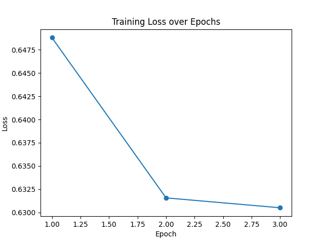

**Отчет о проделанной работе**

**Цель:**

Провести обработку, классификацию и анализ медицинских данных с помощью последовательной реализации четырех этапов: очистка данных, разметка, анализ ключевых слов и применение обученной модели для предсказания состояния.

**1) Очистка и сортировка данных**

**Цель**: удалить ненужные данные, упорядочить записи и подготовить набор данных для последующего анализа.

**Входные данные:** Файл с текстовыми записями медицинских жалоб.

**Действия**: был написан скрипт sort.py который удалял строки с ненужными или дублирующимися значениями (например, пустые строки, "нет", "благополучный", "жалоб нет"). Очистка столбца ParamValue от лишних пробелов и символов. Сортировка данных по столбцу ParamValue.

**Результат:**

Создан очищенный файл данных очищенный_файл.xlsx, содержащий структурированные записи для дальнейшей обработки.

**2) Разметка данных по категориям**

**Цель:** присвоить метки (норма, лёгкое, серьёзное, неопределённо) записям на основе анализа текста.

Входные данные: Файл очищенный_файл.xlsx.

**Действия:** был написан скрипт data analyzing.py который определял категории:

**Серьёзное:** слова, связанные с травмами и экстренными состояниями (например, "травма", "перелом").

**Лёгкое:** симптомы простудных заболеваний (например, "кашель", "насморк").

**Норма**: отсутствие жалоб или состояние здоровья (например, "здоров").

Остальные записи помечены как неопределённо.

**Результат:**

Размеченный файл данных labeled_data.xlsx с метками для каждой записи.

**3) Анализ ключевых слов**

**Цель:** определить наиболее частотные ключевые слова для каждой категории.

**Входные данные:** Файл labeled_data.xlsx.

**Действия:** Подсчёт количества совпадений ключевых слов для категорий серьёзное, лёгкое, норма. Создание отчета с частотой ключевых слов.

**Результат:**

Отчет о частотности ключевых слов сохранен в файл keywords_analysis.xlsx.

**4) Обучение модели**

**Цель:** обучить модель BERT на размеченных данных, чтобы классифицировать медицинские записи на три категории: норма, лёгкое, серьёзное.

**Входные данные:** Файл labeled_data.xlsx, содержащий текстовые данные и категории (Sentiment).

**Действия**: был написан скрипт ns.py который совершает следующий ряд действий

1. **Предобработка текста:**

- Удаление лишних символов, цифр и пунктуации.
- Удаление стоп-слов (на русском языке).
- Лемматизация слов для унификации формы слов.

1. **Преобразование меток категорий:**

Категории (норма, лёгкое, серьёзное, неопределено) преобразуются в числовые значения:

- норма → 0
- лёгкое → 1
- серьёзное → 2
- неопределено → 3

Строки с меткой неопределённо исключаются из данных, так как они не используются в обучении.

1. **Токенизация:**

Текст преобразуется в токены с использованием модели DeepPavlov/rubert-base-cased.

Для каждого текста создаются:

- input_ids: числовое представление токенов.
- attention_mask: маска, указывающая на значимые токены.

**Разделение данных:**

Данные разделяются на:

- Обучающую выборку (70%).
- Валидационную выборку (15%).
- Тестовую выборку (15%).

1. **Взвешивание классов:**

Для устранения дисбаланса классов вычисляются веса классов с использованием compute_class_weight. Это позволяет модели уделять больше внимания менее представленным категориям.

1. **Модель:**

Используется модель BertForSequenceClassification на основе DeepPavlov/rubert-base-cased. Модель настроена для трех классов (num_labels=3).

1. **Обучение:**

В процессе обучения оптимизируется функция потерь CrossEntropyLoss с учетом весов классов. Для оптимизации используется AdamW с шагом обучения 2e-5.Модель обучается в течение 5 эпох, при этом на каждой эпохе:

- Проводится обучение на обучающей выборке.
- Рассчитывается средняя потеря (loss) за эпоху.

1. **Валидация:**

После каждой эпохи модель оценивается на валидационной выборке:

- Прогнозируются метки для валидационных данных.
- Рассчитываются метрики F1, Precision и Recall.

1. **Результаты обучения:**

Потери (loss) визуализируются в виде графика.

Отчет о метриках сохраняется в файл classification_report.xlsx.

Обученная модель сохраняется в файл improved_trained_model.pth.

**Результат:**

Обученная модель: improved_trained_model.pth.

Отчет о метриках: classification_report.xlsx.

График потерь за эпохи (рисунок 1)

**Рисунок 1 - График потерь за эпохи**

**Анализ графика потерь**

Общая динамика: на графике видно, что величина функции потерь (Loss) существенно уменьшается между первой и второй эпохой. Это указывает на то, что модель быстро обучается на начальных этапах, адаптируясь к данным.

Стабилизация: после второй эпохи потери уменьшаются более плавно. Это говорит о том, что модель начинает приближаться к состоянию, в котором дальнейшее обучение приводит к незначительным улучшениям.

Отсутствие переобучения: потери уменьшаются без значительных колебаний или роста, что говорит об отсутствии признаков переобучения на текущем этапе. Однако для полной уверенности стоит проверить метрики на валидационных данных.

**5) Применение обученной модели**

**Цель:** использовать обученную модель для классификации новых медицинских записей.

**Входные данные:**

- Файл очищенный_файл.xlsx.
- Обученная модель improved_trained_model.pth.

**действия:** был написан скрипт zagr.py который совершает следующий ряд действий

1. **Загрузка модели:**

Модель BertForSequenceClassification загружается с параметрами из файла improved_trained_model.pth.

Модель переводится в режим инференса (model.eval()).

1. **Очистка текста:**

Столбец ParamValue очищается:

- Удаляются HTML-коды (&nbsp;), лишние пробелы и символы.
- Приведение текста к нижнему регистру.

Результат сохраняется в новый столбец ParamValue_cleaned.

1. **Токенизация данных:**

Для каждого текста выполняется токенизация с использованием BertTokenizer: создаются input_ids и attention_mask. Максимальная длина текста ограничена 50 токенами.

1. **Подготовка данных для инференса:**

Токены и маски преобразуются в тензоры.Данные загружаются в DataLoader с размером батча 8.

1. **Прогнозирование категорий:**

Для каждого батча данных модель предсказывает вероятности принадлежности к классам.

Класс с максимальной вероятностью выбирается как итоговый прогноз.

1. **Обработка результатов:**

Прогнозы преобразуются в текстовые метки с помощью маппинга:

- 0 → норма
- 1 → лёгкое
- 2 → серьёзное.

Итоговые метки сохраняются в столбец Predicted_Label.

1. **Сохранение результатов:**

Итоговый файл с предсказаниями сохраняется под названием predictions_new_data.xlsx.

**Результат:**

Файл с результатами predictions_new_data.xlsx, содержащий новые данные с прогнозами категорий.
